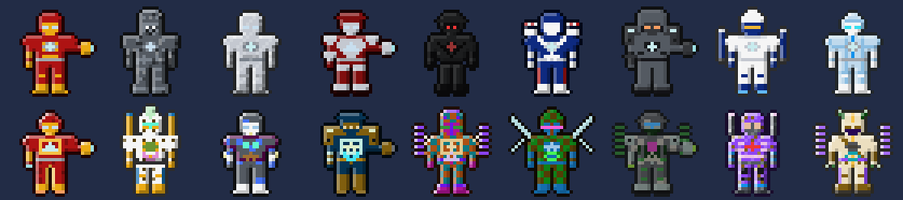
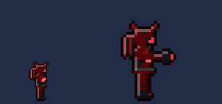
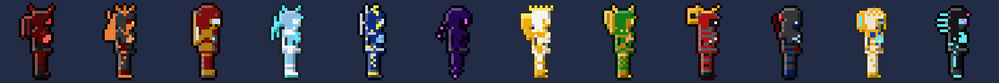

# Marvel: Iron Man — a tModLoader mod for Terraria

An unofficial, fan-made Marvel mod for **tModLoader** (Terraria 1.4.4). Become Iron Man and build your own suit in the Suit Workshop.

*The ten standard preset suits (standing, walking, aiming and flying, facing both ways), drawn by the mod's own suit renderer.*

## Getting started

1. Craft a **Stark Tablet** and an **Arc Reactor Mk I** (recipes below).
2. Equip the Arc Reactor as an accessory.
3. Press **I** (Suit Up) or right-click with the Stark Tablet to suit up. Press it again to suit down.
4. Press **O** (Suit Workshop) or left-click with the Stark Tablet to design your suit.
5. Press **P** (Parts Store), or use the **Parts Store** button in the workshop, to buy more parts with coins.
6. Once you've bought the Giant Suit, press **G** while suited up to become giant.

All four keys can be changed in *Settings → Controls → Mod Controls*. If another mod already uses I, O, P or G, rebind them there.

## Items

| Item | What it does | Recipe |
| --- | --- | --- |
| **Stark Tablet** | Left click: open the Suit Workshop. Right click: suit up / down. | 5 Iron/Lead Bar, 10 Glass, 1 Fallen Star @ Anvil |
| **Arc Reactor Mk I** (accessory) | Lets you suit up. Grants Repulsors and the Shoulder Weapon while suited. | 12 Iron/Lead Bar, 3 Fallen Star, 5 Glass @ Anvil |
| **Arc Reactor Mk II** (accessory) | Stronger suit, no knockback, and adds the Unibeam. | Arc Reactor Mk I, 10 Hallowed Bar, 5 Soul of Light, 5 Soul of Might @ Mythril/Orichalcum Anvil |
| **Arc Reactor Mk III** (accessory) | Strongest suit, and it's immune to lava. | Arc Reactor Mk II, 10 Luminite Bar, 10 Vortex Fragment @ Ancient Manipulator |

Only one Arc Reactor can be worn at a time.

## The suit

While suited up you get:

- **Flight**: hold Jump in the air to fly up, hold Down to dive, left/right to steer. Flying resets fall damage.
- **Stats** (before the Systems options below):

  | Reactor | Defense | Damage reduction | Damage (all) | Crit | Move speed | Regen | Flight speed |
  | --- | --- | --- | --- | --- | --- | --- | --- |
  | Mk I | +10 | 4% | +10% | +4% | +10% | 1 HP/s | 7 |
  | Mk II | +28 | 10% | +25% | +8% | +20% | 3 HP/s | 10 |
  | Mk III | +50 | 16% | +45% | +12% | +30% | 6 HP/s | 13 |

- Water breathing, no fall damage, glowing eyes and reactor. No knockback from Mk II. Lava immunity at Mk III.
- **Ability items** put into your inventory automatically. They disappear when you suit down or drop them.

| Ability | Reactor | What it does |
| --- | --- | --- |
| **Repulsors** | Mk I+ | Palm blasts (28 base damage). Changes with *Repulsor Mode*. |
| **Shoulder Weapon** | Mk I+ | Fires the weapon chosen in *Shoulder Weapon*. |
| **Unibeam** | Mk II+ | Hold to fire a chest beam that stops at walls. It overheats after a few seconds; the cooldown is as long as you fired it for, relative to a full overheat. Changes with *Unibeam Mode*. |

Ability damage grows after you beat Skeletron, the Wall of Flesh, any mechanical boss, Plantera and the Moon Lord (+10/+20/+20/+25/+50 base damage). It is then multiplied by 1x / 1.6x / 2.4x for the Mk I / II / III reactor.

## Suit Workshop

**1,520 options in 37 categories.** Every category is independent, so they combine into about 5.2 × 10⁵⁰ different suits. The workshop shows both numbers, calculated from the catalogue in `Common/Suits/SuitCatalog.cs`.

You start with the classic red-and-gold suit's parts and the first option of each category. Other parts must be bought in the Parts Store (below); locked options show their price in the workshop. **Colours, Glow Strength and Glow Pulse are always free.**

| Group | Categories (number of options) |
| --- | --- |
| Armour | Helmet (28), Faceplate (22), Eyes (24), Chest (28), Arc Reactor (22), Shoulders (22), Gauntlets (24), Belt (8), Legs (24), Boots (22), Back Module (22). These counts include the 12 premium set pieces in each category except Belt. |
| Paint Job | Pattern (14), Emblem (12), Finish (8: Metallic, Matte, Chrome, Gloss, Stealth, Battle-Damaged, Obsidian, Radiant) |
| Colours | 11 colour slots with 96 colours each: Primary, Secondary, Accent, Trim, Undersuit, Pattern, Emblem, Eye Glow, Reactor Glow, Repulsor Glow, Thrusters |
| Effects | Glow Strength (5), Glow Pulse (4), Thruster Trail (12) |
| Systems | Repulsor Mode (6), Shoulder Weapon (6), Unibeam Mode (4), Armour Plating (5), Thrusters (5), Power Core (5) |
| Weapons | Weapon Slot I (18), Weapon Slot II (18), Weapon Colour (96) - see Attached weapons below |

The **Systems** options change how the suit plays:

- **Repulsor Mode**: Standard, Rapid (2x fire rate, weaker), Spread (3 shots), Heavy (slow, explosive), Piercing (goes through 5 enemies), Twin (2 parallel shots).
- **Shoulder Weapon**: Micro-Missiles (3 homing missiles), Minigun, Flare Pods (5 burning flares), Shoulder Laser (piercing), Heavy Rocket (big explosion), Cluster Bombs (split into 6 bomblets).
- **Unibeam Mode**: Focused, Wide (wider, weaker), Pulse (flickers on and off, stronger), Overcharge (much stronger, short, long cooldown).
- **Armour Plating**: Light, Standard, Reinforced, Heavy, Vibranium Alloy (defense against speed).
- **Thrusters**: Standard, Racing, Heavy-Lift, Hover (holds altitude when you let go), Afterburner.
- **Power Core**: Balanced, Overclocked, Efficient, Regenerative, Unstable (damage, attack speed and regeneration trade-offs).

The workshop has a live animated preview, the suit's stats for your current reactor, **Random Armour / Random Colours / Random Everything** buttons (they only pick parts you own), **22 presets** (one per premium set), and **5 save slots** per character. Your design is saved with the character and synced to other players in multiplayer.

## Attached weapons

The suit has **two weapon slots**. Buy weapons in the Parts Store's **Weapons** tab; each purchase works in either slot. Attach them in the workshop's Weapons group, or with **Equip** in the store (it fills an empty slot first). Attached weapons are carried on the suit's back (wrist blades sit on the gauntlet) and are tinted with the **Weapon Colour**. While suited up, the **Weapon I** and **Weapon II** ability items use whatever is in each slot. Loading a preset keeps your attached weapons.

Damage below is base damage. Like the other abilities, it grows with bosses beaten and your Arc Reactor mark.

| Weapon | Type | Damage | Price | Unlocks after | What it does |
| --- | --- | --- | --- | --- | --- |
| **Energy Sword** | melee | 48 | 5g | - | Glowing blade, wide swings |
| **Riot Shield** | melee | 30 | 5g | - | Hold to block: +20 defense, 35% less damage, no knockback. Destroys enemy projectiles that hit it and bashes enemies |
| **Battle Axe** | melee | 70 | 6g | - | Slow heavy chops that ignore 20 defense |
| **Throwing Spear** | ranged | 55 | 4g | - | Thrown, arcs down, pierces 3 enemies |
| **Reaper Scythe** | melee | 60 | 12g | Wall of Flesh | Full 360° spin; hits heal you a little |
| **Katana** | melee | 40 | 8g | - | Very fast slashes, +20% crit chance |
| **Anti-Tank Railgun** | ranged | 400 | 40g | a mechanical boss | Instant beam through every enemy up to the first wall, big recoil |
| **Warhammer** | melee | 90 | 10g | Wall of Flesh | Crushing swings; the first hit of each swing makes a shockwave |
| **Energy Whip** | melee | 42 | 8g | - | Long energy lash (240 px reach) |
| **Chakram** | ranged | 45 | 6g | - | Bladed disc that flies out and comes back |
| **Flamethrower** | ranged | 14 | 10g | Wall of Flesh | Short-range fire stream that passes through crowds and burns |
| **Plasma Cannon** | ranged | 120 | 20g | Plantera | Slow plasma orb with a huge explosion |
| **Wrist Blades** | melee | 34 | 4g | - | Rapid stabs from the gauntlets |
| **Grenade Launcher** | ranged | 65 | 6g | - | Grenades that bounce twice, then explode |
| **Energy Lance** | melee | 75 | 15g | a mechanical boss | Charge forward while thrusting a long energy lance |
| **Arc Caster** | ranged | 50 | 18g | Plantera | Lightning hits the enemy nearest your cursor and chains to 3 more |
| **Buzzsaw Launcher** | ranged | 40 | 10g | Wall of Flesh | Saw blades that ricochet off walls up to 4 times |

## Giant suit

Buy the **Giant Suit** for **50 platinum** at the top of the Parts Store's Premium Sets tab. While suited up, press **G** (the Giant Suit key, rebindable) or use **Transform** in the store to become a giant version of your own suit design, drawn twice as big. Press it again to turn back. Giant form ends if you suit down.

In giant form you get **+80 defense, +25% damage reduction, +50% damage and no knockback** (damage reduction from the suit is capped at 80% in total), but you move 20% slower and fly 25% slower. Your collision box stays normal-sized; only the sprite is giant (resizing the hitbox breaks collision with blocks).

Your normal suit abilities are replaced by nine giant ones. Damage is base damage (it scales like the other abilities):

| Ability | Damage | Cooldown | What it does |
| --- | --- | --- | --- |
| **Titan Punch** | 150 | - | Huge punch in front of you, massive knockback |
| **Ground Pound** | 200 | 4 s | Slam the ground for a big shockwave; in the air you dive first |
| **Mega Repulsor** | 120 | - | Enormous repulsor blast with a huge explosion |
| **Missile Barrage** | 60 x 12 | 8 s | Twelve homing missiles from the shoulders |
| **Giant Unibeam** | 90 | Unibeam overheat | A Unibeam three times as wide; uses your Unibeam Mode; needs a Mk II reactor |
| **Shockwave Clap** | 110 | 3 s | A shockwave that rolls along the ground |
| **Rocket Charge** | 130 | 5 s | Rocket towards the cursor, ramming enemies, briefly invincible |
| **Shield Dome** | - | 30 s | 6 seconds of 40% less damage; enemy projectiles that reach the dome are destroyed |
| **Orbital Strike** | 350 | 20 s | Mark the cursor's position; a beam hits it from orbit a moment later |

Cooldowns show as a countdown on the ability's icon.

## Admin panel

Type **`admin!`** in chat and press Enter. The message isn't sent. Instead a password box opens; enter the admin password to open the admin panel. After that, `admin!` opens the panel straight away until you close the game or reload mods.

The panel only affects your own character:

- **Parts:** unlock every part, weapon and the giant suit, or reset all purchases (your suit goes back to the classic parts).
- **Items and money:** Arc Reactor Mk I / II / III, a Stark Tablet, 1 or 10 platinum coins.
- **Cheats** (not saved): god mode, super flight (2x flight speed and acceleration), no Unibeam cooldown, full heal.

Only a SHA-256 hash of the password is kept in the code (`Common/Systems/AdminSystem.cs`). This mod ships with its source readable, so the password keeps casual players out but is **not real security**: anyone determined can bypass it.

## Parts Store

Open it with **P** or the workshop's **Parts Store** button. Pay with coins from your inventory, piggy bank, safe, Defender's Forge or Void Vault. Click anything to see it in the **try-on preview** before you buy, then **Equip** it.

| Tab | What's in it | Price |
| --- | --- | --- |
| Premium Sets | 12 sets of 10 pieces each, with set bonuses (below) | per piece, or 15% off when you buy the rest of a set |
| Weapons | The 17 attached weapons above | 4g - 40g |
| Armour | Helmets, faceplates, eyes, chests, reactors, shoulders, gauntlets, belts, legs, boots, back modules | 50 silver, going up 50 silver for each later option in a list (up to 8 gold) |
| Paint & Effects | Patterns, emblems, finishes, thruster trails | 50 silver - 7 gold; trails 1 gold; premium finishes and trails below |
| Systems | Repulsor, shoulder weapon and Unibeam modes, plating, thrusters, power cores | 5 gold each |

Premium extras: **Obsidian** finish (8g, after the Wall of Flesh), **Radiant** finish (20g, after Plantera), and the **Blood** (5g, Hardmode), **Holy Light** and **Frost** (10g, after a mechanical boss) and **Void** (20g, after the Lunatic Cultist) thruster trails.

### Premium sets

*Vampiric, Infernal, Titan, Cryo, Storm, Void, Godly, Dragon, Samurai, Shinobi, Pharaoh and Cyber, each shown with its preset colours.*

Each set has a helmet, faceplate, eyes, chest, arc reactor, shoulders, gauntlets, legs, boots and back module. Wear **all 10 pieces while suited up** to get the set bonus. The Belt, colours and Systems options don't matter for the set bonus. The workshop shows how many pieces of the closest set you're wearing.

| Set | Unlocks after | Price per piece (whole set) | Set bonus |
| --- | --- | --- | --- |
| **Vampiric** | Wall of Flesh | 6g (51g) | +10% damage (+20% at night). Hits heal you for 8% of damage dealt (1-12 HP). Immune to Bleeding. |
| **Infernal** | Wall of Flesh | 6g (51g) | +15% damage. Immune to fire and lava. Hits inflict Hellfire. |
| **Titan** | Any mechanical boss | 12g (1p 2g) | +40 defense, +8% damage reduction, no knockback, 50% thorns. 10% slower. |
| **Cryo** | Plantera | 15g (1p 27g 50s) | +15% crit. Immune to Chilled, Frozen and Frostburn. Hits inflict Frostbite. |
| **Storm** | Golem | 20g (1p 70g) | +25% move and flight speed. 25% of hits arc lightning to another enemy for half damage. |
| **Void** | Lunatic Cultist | 30g (2p 55g) | +20% damage. 12% chance to phase through an attack. Immune to Darkness, Blackout and Obstructed. |
| **Godly** | Moon Lord | 50g (4p 25g) | +30% damage, +10% crit, +30 defense, +10% damage reduction, +8 HP/s regen, +30% flight speed. Immune to most debuffs. 10% of hits call down holy light (a damaging blast). |
| **Shinobi** | Wall of Flesh | 6g (51g) | +20% move speed, +15% crit. 8% chance to dodge an attack. Enemies are less likely to target you. |
| **Samurai** | Any mechanical boss | 12g (1p 2g) | +20% melee damage, +15% melee speed, +10% crit. The Katana deals 25% more damage. |
| **Pharaoh** | Plantera | 15g (1p 27g 50s) | +12% damage, +20 defense. Hits inflict Venom and Ichor. Immune to Poisoned, Venom, Slow and Weak. |
| **Dragon** | Plantera | 18g (1p 53g) | +20% damage, +20% flight speed. Immune to fire and lava. Hits inflict Daybreak, and 15% of hits make you breathe fire at the target. |
| **Cyber** | Lunatic Cultist | 30g (2p 55g) | +15% damage, +15% attack speed. Every 5th hit launches a homing missile. |

The "whole set" price is for all 10 pieces. If you already own some pieces, you only pay for the rest.

Characters created before the Parts Store existed keep every part they were already using or had saved in a slot.

### How the suit is drawn

The suit isn't a fixed sprite sheet. `Common/Suits/SuitRenderer.cs` builds it from small ASCII pixel masks for each part (`Common/Suits/SuitParts.cs`). It is drawn in side view facing right, and flipped when the player faces left. The masks are designed as front views, so the renderer adapts them. It puts the faceplate, eyes and reactor on the front edge, draws the near arm and leg over a darker far arm and leg, and shows only the half of each back module that sits behind the back. It adds patterns, emblem, finish shading and an outline, then caches the result as a texture. To add a new helmet, chest or other part, add a mask to `SuitParts.cs`. It shows up in the workshop and the store automatically, and the option count updates too. New premium sets go in `Common/Suits/SuitSets.cs`, new weapons in `Common/Suits/SuitWeapons.cs` (their sprites are in `Content/Weapons/`), and prices are set in `Common/Suits/SuitShop.cs`.

## Installing from source

1. Copy this repository into your tModLoader `ModSources` folder, **in a folder named `MarvelMod`**. The folder name must match the mod's internal name, so rename it if you cloned it as `marvel-mod`.
2. In tModLoader, go to *Workshop → Develop Mods* and click **Build + Reload** next to *Marvel: Iron Man*.

`tools/generate_sprites.py` regenerates the item, buff and projectile sprites (needs Pillow).

This is an unofficial fan project and is not affiliated with or endorsed by Marvel or Disney.
